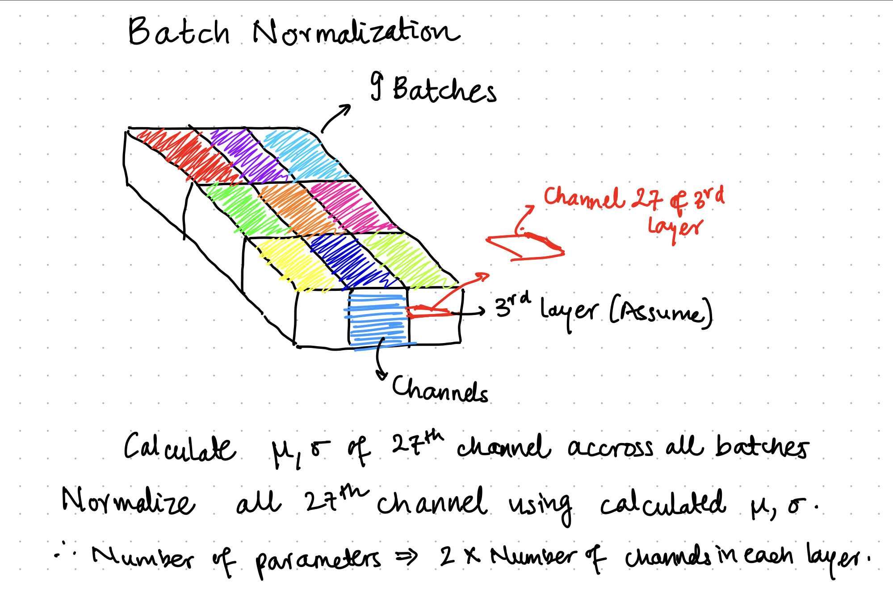
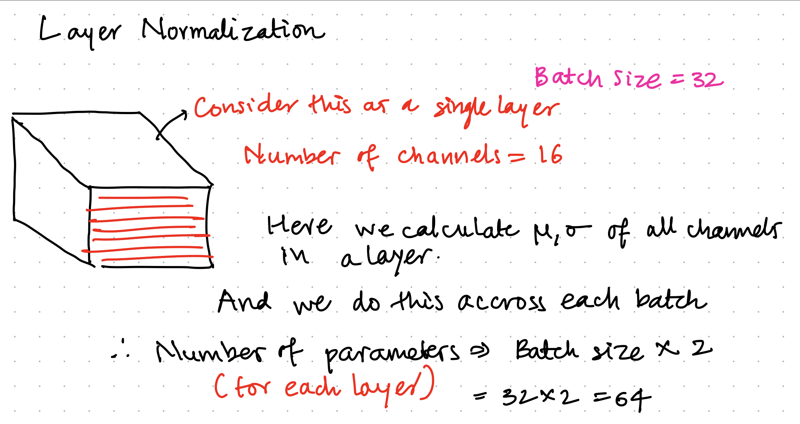
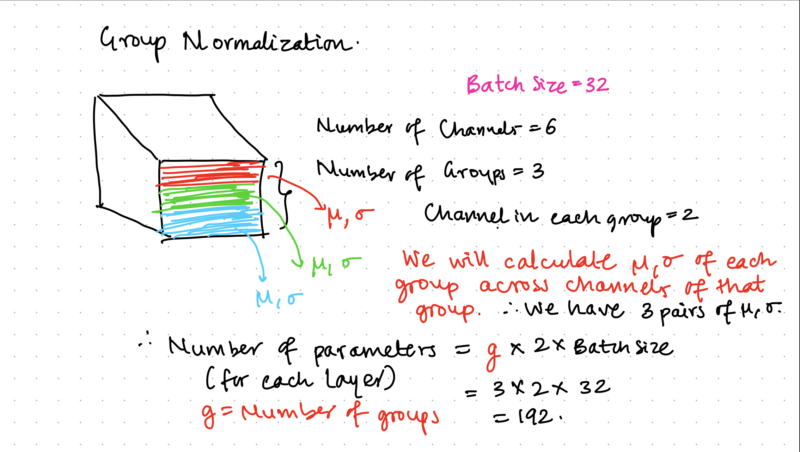
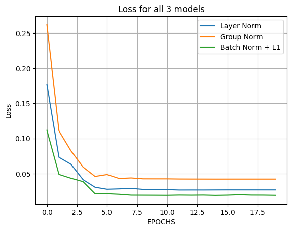
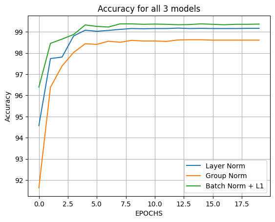
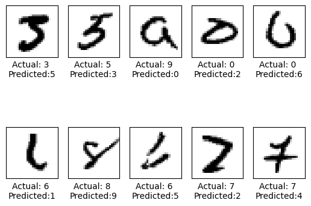
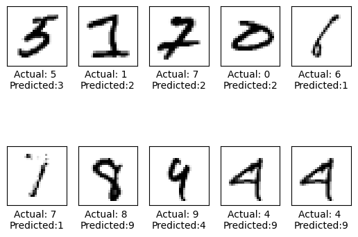
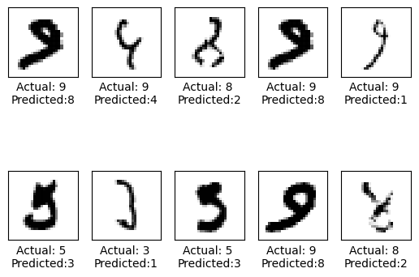

# Experimenting with Normalization and Regularization

## Batch Normalization

## Layer Normalization
)

## Group Normalization

### Loss chart for all three models

### Accuracy chart for alll three models

## Misclassified images for all the models:

#### Layer Normalization - misclassified images

#### Group Normalization - misclassified images

#### Batch Normalization + L1 Regularization - misclassified images
